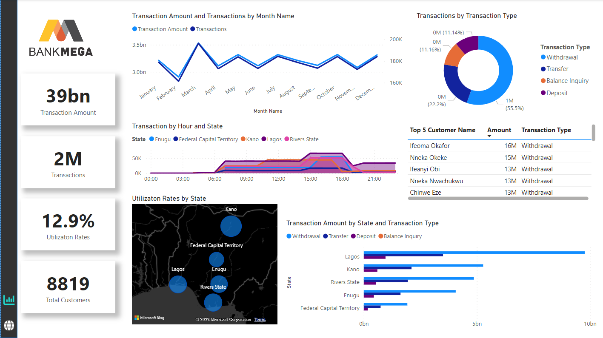
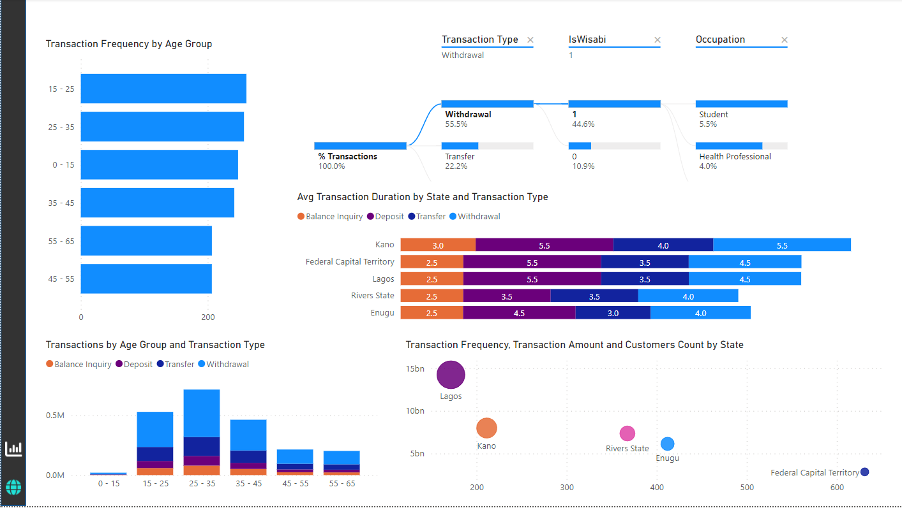

# ATM Transaction Insights Power BI Project

## Overview
Explore ATM transaction data with insightful visualizations. Gain key metrics on transaction amounts, counts, ATM utilization rates, and customer demographics.

## Screenshots

*Overview page showcases KPIs, charts, and utilization rates.*

*Demographics page highlights transaction frequency, age groups, transaction types, and more.*

## Data Model
- **Location:** ATM locations and details.
- **Calendar:** Date-related information.
- **Customer:** Customer details and demographics.
- **Hour:** Transaction hours and time details.
- **Transaction Type:** Types of transactions.
- **Transaction:** Fact table with transaction details.

## Key Features
- KPIs: Total transaction amount, total transactions, ATM utilization rates, and total customers.
- Charts: Transaction amount and count by month, ATM transactions by hour and state.
- Map: Utilization rates of ATMs by state.
- Demographics: Transaction frequency, age group analysis, tree chart for transaction details, average ATM transaction duration by state and type.

## How to Use
1. Clone the repository.
2. Open `ATM_Transaction_Insights.pbix` using Power BI Desktop.
3. Configure data connections.
4. Refresh data for the latest insights.
5. Explore visualizations on the Overview and Demographics pages.

## Contributing
Contribute by opening issues or pull requests. Your feedback and enhancements are valued.

## License
This project is licensed under the [MIT License](LICENSE).
